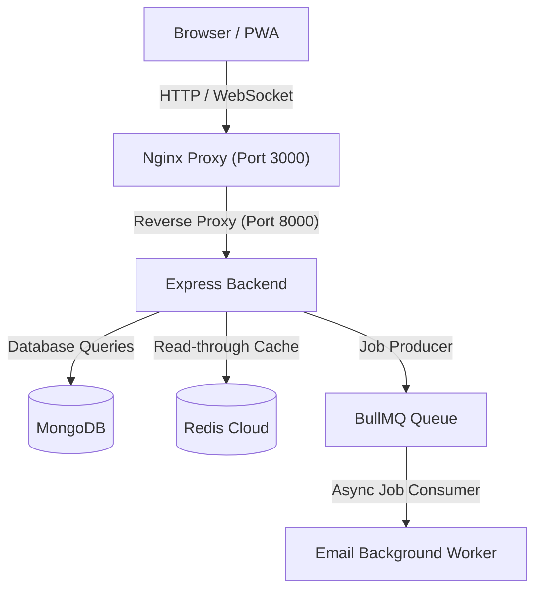
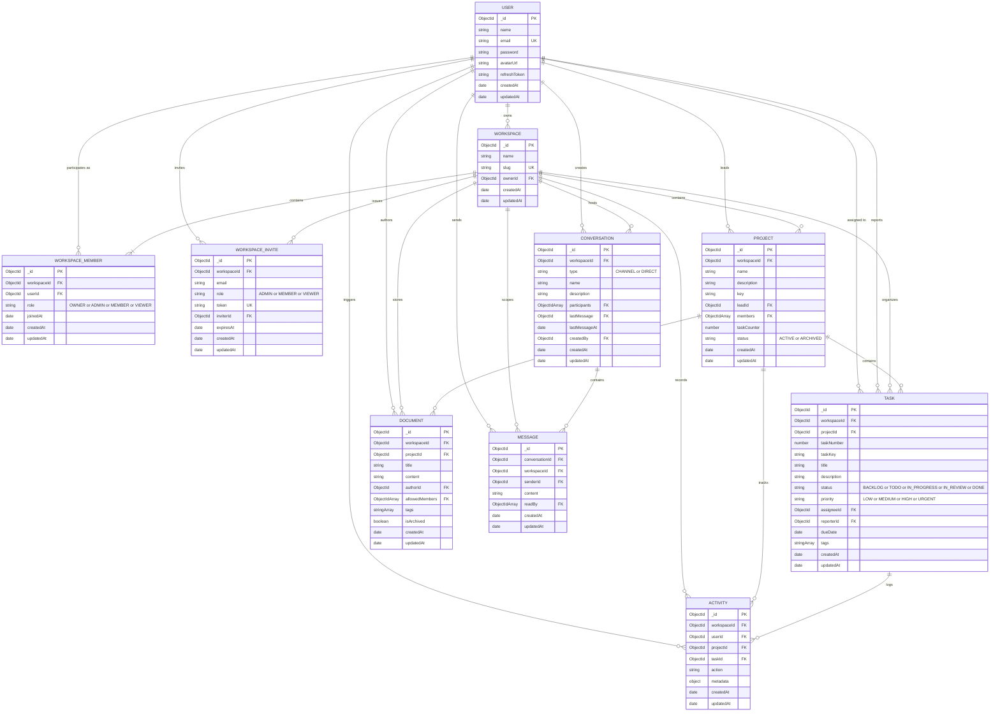

# TeamFlow — Mini SaaS Workspace Platform

TeamFlow is a production-grade workspace collaboration platform inspired by Notion, Trello, and Slack. It features real-time state synchronization, role-based access control (RBAC), multi-tier performance caching with Redis, background job scheduling with BullMQ, and complete Docker orchestration.

---

## Key Features

- **Real-Time Collaboration**: Dynamic task updates and team presence powered by Socket.io.
- **Performance Layer**: Redis caching with automated invalidation for read-heavy operations (e.g., workspace membership).
- **Background Worker Engine**: BullMQ processing email dispatching independently of client request loops.
- **PWA & Offline Capability**: Built using `vite-plugin-pwa` with service workers and a live connectivity status monitor.
- **Role-Based Access Control (RBAC)**: Fine-grained permissions across Admin, Member, and Viewer roles.
- **Dockerized Architecture**: Multi-stage production containerization orchestrated with Docker Compose.
- **Automated CI/CD**: GitHub Actions pipeline checking frontend builds, environment verification, and Docker image construction.

---

## Tech Stack

- **Frontend**: React 18, Vite, Tailwind CSS, Lucide Icons, Vite PWA
- **Backend**: Node.js, Express, Socket.io, BullMQ, ioredis, Mongoose
- **Database & Cache**: MongoDB, Redis Cloud
- **DevOps & Infrastructure**: Docker, Docker Compose, Nginx, GitHub Actions

---

## Architecture Diagram

