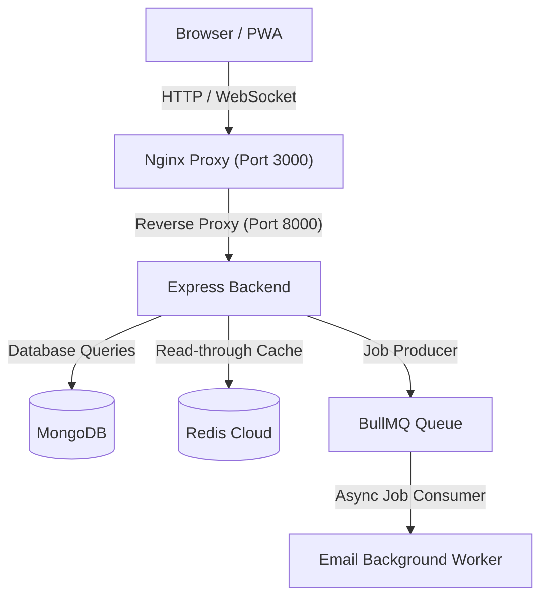

# TeamFlow — Mini SaaS Workspace Platform

TeamFlow is a production-grade workspace collaboration platform inspired by Notion, Trello, and Slack. It features real-time state synchronization, role-based access control (RBAC), multi-tier performance caching with Redis, background job scheduling with BullMQ, and complete Docker orchestration.

---

## Key Features

- **Real-Time Collaboration**: Dynamic task updates and team presence powered by Socket.io.
- **Performance Layer**: Redis caching with automated invalidation for read-heavy operations (e.g., workspace membership).
- **Background Worker Engine**: BullMQ processing email dispatching independently of client request loops.
- **PWA & Offline Capability**: Built using `vite-plugin-pwa` with service workers and a live connectivity status monitor.
- **Role-Based Access Control (RBAC)**: Fine-grained permissions across Admin, Member, and Viewer roles.
- **Dockerized Architecture**: Multi-stage production containerization orchestrated with Docker Compose.
- **Automated CI/CD**: GitHub Actions pipeline checking frontend builds, environment verification, and Docker image construction.

---

## Tech Stack

- **Frontend**: React 18, Vite, Tailwind CSS, Lucide Icons, Vite PWA
- **Backend**: Node.js, Express, Socket.io, BullMQ, ioredis, Mongoose
- **Database & Cache**: MongoDB, Redis Cloud
- **DevOps & Infrastructure**: Docker, Docker Compose, Nginx, GitHub Actions

---

## Architecture Diagram

erDiagram
    USER ||--o{ WORKSPACE : "creates / owns"
    USER ||--o{ WORKSPACE_MEMBER : "participates as"
    USER ||--o{ WORKSPACE_INVITE : "sends"
    USER ||--o{ TASK : "assigned to"
    USER ||--o{ TASK : "creates"
    USER ||--o{ TASK_COMMENT : "posts"
    USER ||--o{ CHANNEL_MESSAGE : "sends"
    USER ||--o{ ACTIVITY_LOG : "performs"
    USER ||--o{ NOTIFICATION : "receives"

    WORKSPACE ||--|{ WORKSPACE_MEMBER : "contains"
    WORKSPACE ||--o{ WORKSPACE_INVITE : "issues"
    WORKSPACE ||--o{ TASK : "organizes"
    WORKSPACE ||--o{ CHANNEL : "hosts"
    WORKSPACE ||--o{ ACTIVITY_LOG : "tracks"
    WORKSPACE ||--o{ NOTIFICATION : "scopes"

    CHANNEL ||--o{ CHANNEL_MESSAGE : "stores"
    TASK ||--o{ TASK_COMMENT : "has"

    USER {
        ObjectId _id PK
        string name
        string email UK
        string password
        string avatarUrl
        string refreshToken
        date createdAt
        date updatedAt
    }

    WORKSPACE {
        ObjectId _id PK
        string name
        string slug UK
        string description
        ObjectId ownerId FK
        string iconUrl
        date createdAt
        date updatedAt
    }

    WORKSPACE_MEMBER {
        ObjectId _id PK
        ObjectId workspaceId FK
        ObjectId userId FK
        string role "OWNER or ADMIN or MEMBER or VIEWER"
        date joinedAt
        date createdAt
        date updatedAt
    }

    WORKSPACE_INVITE {
        ObjectId _id PK
        ObjectId workspaceId FK
        ObjectId invitedBy FK
        string email
        string role
        string token UK
        string status "PENDING or ACCEPTED or EXPIRED"
        date expiresAt
        date createdAt
    }

    TASK {
        ObjectId _id PK
        ObjectId workspaceId FK
        string title
        string description
        string status "TODO or IN_PROGRESS or DONE"
        string priority "LOW or MEDIUM or HIGH or URGENT"
        ObjectId assigneeId FK
        ObjectId creatorId FK
        number position
        date dueDate
        date createdAt
        date updatedAt
    }

    TASK_COMMENT {
        ObjectId _id PK
        ObjectId taskId FK
        ObjectId userId FK
        string content
        date createdAt
        date updatedAt
    }

    CHANNEL {
        ObjectId _id PK
        ObjectId workspaceId FK
        string name
        string topic
        boolean isPrivate
        date createdAt
        date updatedAt
    }

    CHANNEL_MESSAGE {
        ObjectId _id PK
        ObjectId channelId FK
        ObjectId senderId FK
        string content
        date createdAt
        date updatedAt
    }

    ACTIVITY_LOG {
        ObjectId _id PK
        ObjectId workspaceId FK
        ObjectId userId FK
        string action
        string entityType
        ObjectId entityId
        date createdAt
    }

    NOTIFICATION {
        ObjectId _id PK
        ObjectId recipientId FK
        ObjectId workspaceId FK
        string title
        string message
        string type
        boolean isRead
        date createdAt
    }
